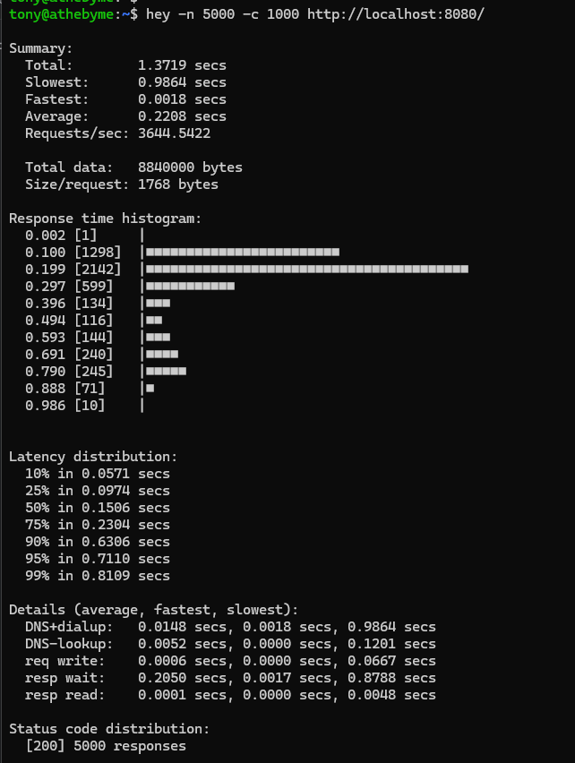
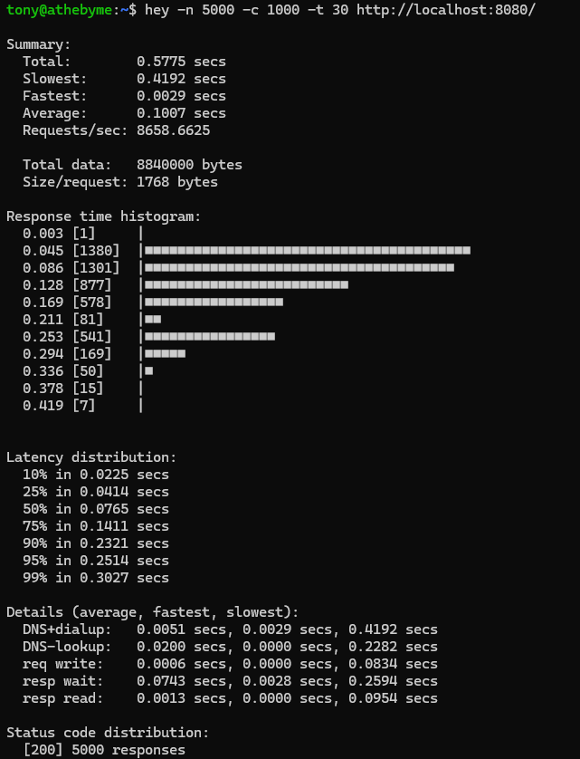
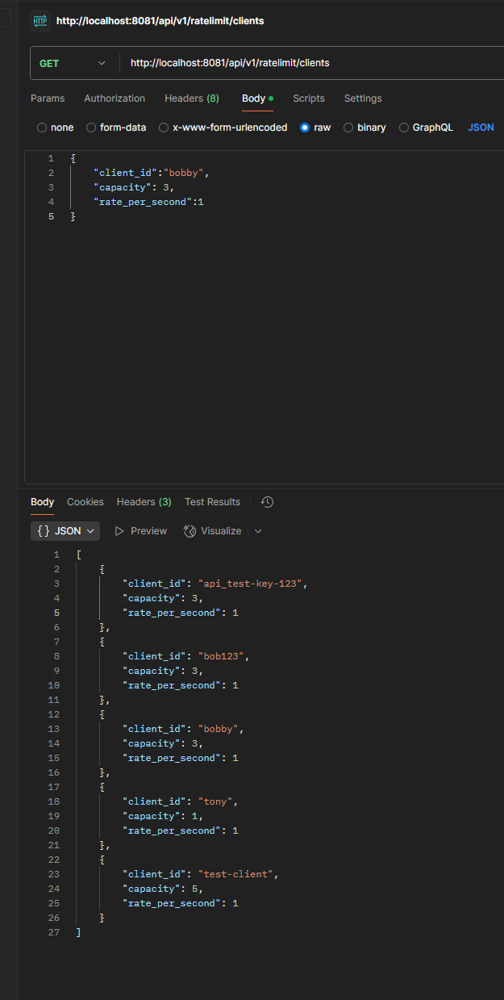
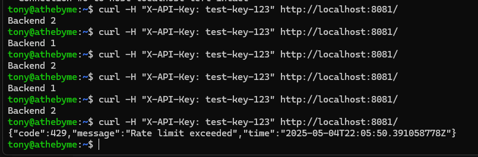

# Тестовое задание для Cloud.ru Camp

Привет! Меня зовут Антон, мне 20 и я студент 3 курса ИТМО, направления Информационные системы и технологии.

Это мое решение тестового задания на стажировку в cloud.ru

## Вопросы для разогрева

### Самая интересная задача в программировании?

Для меня понятие задачи конкретно в программировании растяжимо. Если смотреть глобально с технической точки зрения - для меня самое любимое это проектирование и реализация проекта по определенной структуре. Особенно приятно и классно потом рефачить код (я раньше писал монолит без солида))  )   

Если выделять конкретную задачу - думаю, что разработка системы по работе с товарами на маркетплейсе является для меня самой тяжелой, но в то же время самой интересной комплексной задачей. Свои алгоритмы, архитектура и решения. 

### Мой самый большой факап?

Факапы случаются - отрицать этот факт глупо. Я думаю мой самый заметный последний факап был, когда я переносил логику сервиса по сбору статистик с маркетплейса, делал миграцию базы и бизнес контракт на обновление статистики в бд, потому что база тогда собирала стату каждые 10 минут, по 15к записей (от кол-ва товаров зависит) -- короче база весила слишком много, а сервисный код уже работал, это трогать нельзя было. Тогда в месте, где с одной дтошки я заполнял энтити для новой таблицы невнимательно указал время сбора статистики `recorded_at` не как время с общей базы, а как время текущее на момент переноса. так я потерял около 15 миллионов записей до того, как заметил. теперь делаю вакуум только после того, как 100 раз проверил все.

### Ожидания от участия в буткемпе?

Хочу получить опыт реального продакшн кода. У меня были только учебные проекты + коммерческие проекты, которые идейно и технически реализовывал я один. Хочу попасть в команду к профессионалам, чтобы расти карьерно.
## HTTP-балансировщик нагрузки

Был вопрос про `Сохранять состояние клиентов (текущие токены, настройки) в БД или файле.`- не уверен, что хранение токенов в бд - лучшая практиика. так что сделал гибрид - токены в редисе (ну конечно можно было бы мб ин мемори кэш потокобезопасный), а клиентов в постгре

Балансировщик:

### Основной функционал
- HTTP-сервер на порту 8080 (или любом другом из конфига)
- Использую стандартный `net/http` и `httputil.ReverseProxy`
- Поддержка разных алгоритмов балансировки (round-robin, least-connections, random)
- Обработка 503 ошибок, когда все бэкенды упали

### Проверка здоровья
- Проверяю бэкенды по HTTP GET запросу
- Мертвые сервера временно исключаются из пула
- Автоматическое восстановление при возврате

### Rate Limiting на Token Bucket
- Реализован алгоритм Token Bucket
- Отдельные лимиты для каждого клиента (по IP или API-ключу)
- CRUD API для управления лимитами
- Graceful shutdown без потери запросов

### Конфигурация
Использую YAML конфиг:

```yaml
listenAddress: ":8080"
backends:
  - "http://backend1"
  - "http://backend2"
log:
  level: "info"
  format: "text"
healthCheck:
  enabled: true
  interval: "10s"
rateLimit:
  enabled: true
  defaultCapacity: 100
  defaultRatePerSecond: 10
```

## Архитектура

Следовал Hexagonal Architecture (Ports and Adapters):
- Core domain - чистая бизнес-логика
- Ports - интерфейсы для изоляции
- Adapters - реализация для внешних систем
- Dependency Injection для тестируемости

Структура:
```
internal/
├── adapters/
│   ├── primary/     # HTTP handlers
│   └── secondary/   # Database, Redis, etc.
├── core/
│   ├── app/         # Application services
│   └── domain/      # Business logic
└── config/          # Configuration
```

## Производительность

Вот бенчмарки, которые я прогнал:

```
BenchmarkLoadBalancer_RoundRobin-16                16852     67890 ns/op
BenchmarkRateLimiter_Allow-16                   14488711        73.74 ns/op
BenchmarkRateLimiter_ConcurrentAccess-16         4697314       257.1 ns/op
BenchmarkLoadBalancer_WithRateLimit-16             15561     83047 ns/op
BenchmarkMemoryPool_GetNextHealthyBackend-16   10359858       106.7 ns/op
```

Rate limiter довольно шустрый - 73 ns на проверку токена в одном треде

## Нагрузочные тесты с hey

Обычный режим:
```
hey -n 5000 -c 1000 http://localhost:8080/
Total: 1.3719 secs
Requests/sec: 3644.5422
```

С таймаутом:
```
hey -n 5000 -c 1000 -t 30 http://localhost:8080/
Total: 0.5775 secs
Requests/sec: 8658.6625
```
(порт был 8080, затем поменял, тк у меня параллельно запущена кафка ui на 8080 порту, так что в компоузе мап сделал на 8081 внешний -- далее будет)




Нормально держит нагрузку

## Как запустить

### Быстрый старт с Docker

```bash
docker-compose up --build

curl http://localhost:8081

docker-compose run e2e-tests
```

### Локальный запуск

```bash
go run cmd/lb/main.go -config ./configs/config.yml

go test -v ./tests/integr

go test -bench=. -race ./tests/integration
```

## API для rate limiting

```bash
curl -X POST http://localhost:8081/api/v1/ratelimit/clients \
  -H "Content-Type: application/json" \
  -d '{"client_id": "user1", "capacity": 100, "rate_per_second": 10}'

curl http://localhost:8081/api/v1/ratelimit/clients

curl -X DELETE http://localhost:8081/api/v1/ratelimit/clients/user1
```




## Важная информация о Rate Limiting

При использовании Rate Limiting API важно понимать, как формируются идентификаторы клиентов:

1. При использовании `X-API-Key` заголовка, система автоматически добавляет префикс `api_`
2. При идентификации по IP адресу, используется префикс `ip_`
3. В API для создания/удаления клиентов используйте полный идентификатор включая префикс

Например:

```bash
# Создание клиента (будет сохранен как "api_my-client")
curl -X POST http://localhost:8081/api/v1/ratelimit/clients \
  -H "Content-Type: application/json" \
  -d '{"client_id": "api_my-client", "capacity": 100, "rate_per_second": 10}'

curl -H "X-API-Key: my-client" http://localhost:8081
```


**Базовый URL:** `/api/v1/ratelimit`

---

### Управление клиентами

#### 1. Создать или обновить настройки клиента

*   **Метод:** `POST`
*   **Путь:** `/clients`
*   **Описание:** Создает нового клиента с заданными лимитами или обновляет лимиты для существующего клиента.
*   **Тело запроса (Request Body):** `application/json`

    ```json
    {
      "client_id": "bobby",
      "capacity": 100,
      "rate_per_second": 10
    }
    ```
    *   `client_id` (string, required): Уникальный идентификатор клиента (должен включать префикс `api_` или `ip_`, если лимиты применяются через middleware).
    *   `capacity` (integer, required): Максимальная емкость "ведра токенов" (burst). Должна быть > 0.
    *   `rate_per_second` (integer, required): Скорость пополнения токенов в секунду. Должна быть > 0.

*   **Успешный ответ (Success Response):**
    *   **Код:** `201 Created`
    *   **Тело ответа (Response Body):** `application/json` - JSON с созданными/обновленными настройками.

      ```json
      {
        "client_id": "bobby",
        "capacity": 100,
        "rate_per_second": 10
      }
      ```

#### 2. Получить список всех клиентов

*   **Метод:** `GET`
*   **Путь:** `/clients`
*   **Описание:** Возвращает список всех клиентов, для которых настроены лимиты.
*   **Тело запроса (Request Body):** Нет.

*   **Успешный ответ (Success Response):**
    *   **Код:** `200 OK`
    *   **Тело ответа (Response Body):** `application/json` - JSON-массив объектов с настройками клиентов.

      ```json
      [
        {
          "client_id": "bobby",
          "capacity": 100,
          "rate_per_second": 10
        },
        {
          "client_id": "tony",
          "capacity": 50,
          "rate_per_second": 5
        }
      ]
      ```
    *Примечание: Если клиентов нет, вернется пустой массив `[]`.*

#### 3. Удалить настройки клиента

*   **Метод:** `DELETE`
*   **Путь:** `/clients/{clientID}`
*   **Описание:** Удаляет настройки rate limiting для указанного клиента.
*   **Параметр пути (Path Parameter):**
    *   `clientID` (string, required): Идентификатор клиента, настройки которого нужно удалить (включая префикс).
*   **Тело запроса (Request Body):** Нет.

*   **Успешный ответ (Success Response):**
    *   **Код:** `204 No Content`
    *   **Тело ответа (Response Body):** Нет.

---

**Обработка ошибок:**

В случае ошибок (например, неверный JSON, не найденный клиент, ошибки сервера) API вернет соответствующий HTTP статус (4xx или 5xx) и JSON-тело с описанием ошибки:

```json
{
  "error": "Описание ошибки"
}
```

## Что мне больше всего понравилось

1. Гексагональная архитектура - мой любимый вариант архитектуры (хотя дефолтный mvc тоже кайф)
2. Golang прекрасно справляется с конкурентностью
3. Кайф писать собственные алгоритмы (Token Bucket)

## Что бы добавил, если бы было больше времени

1. Distributed rate limiting с Redis
2. Websocket support
3. Prometheus метрики + мб визуал графану и импорт логов в графану
4. Circuit breaker pattern
5. Dynamic configuration reload
6. Кейклок аутентификацию (либо какую нибудь dumb jwt реализацию)
7. Вынес бы ошибки в ошибки сервисов, для переиспользования
8. Swagger